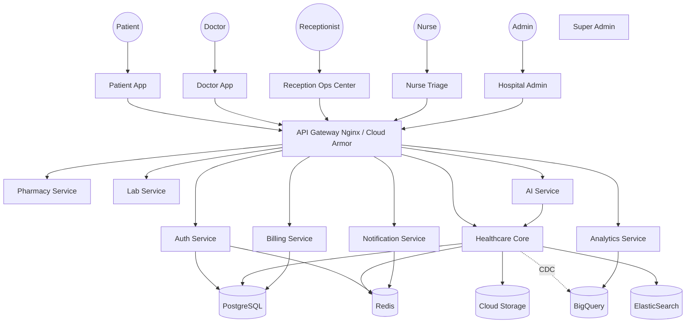
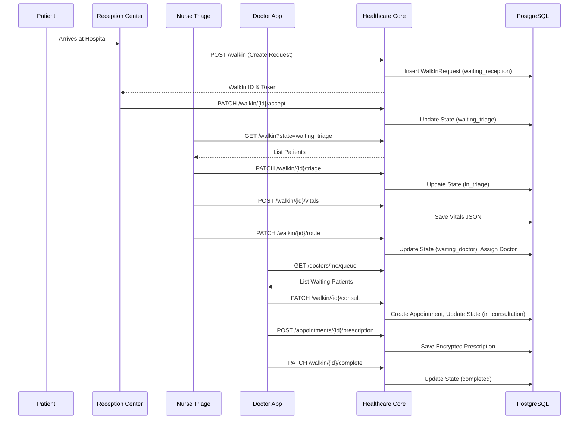

# HOSPYN ULTIMATE CTO TECHNICAL BLUEPRINT
## PART 1: OVERVIEW & PRODUCT ECOSYSTEM

---

# SECTION 1 — PLATFORM OVERVIEW

## What is Hospyn
Hospyn (formerly AI Health Passport) is a comprehensive, enterprise-grade healthcare management and patient journey ecosystem. It digitizes the entire lifecycle of healthcare delivery—from initial patient discovery, triage, and appointment booking, to teleconsultations, electronic medical records (EMR), pharmacy fulfillment, lab diagnostics, and post-care follow-ups. Simultaneously, Hospyn operates as a centralized Command Center for healthcare facilities, enabling receptionists, nurses, doctors, and administrators to orchestrate operations seamlessly. Built on a zero-trust, multi-tenant microservices architecture, Hospyn ensures cryptographic integrity of Protected Health Information (PHI) while delivering consumer-grade user experiences.

## Business Objective
Our business objective is to become India's #1 healthcare infrastructure SaaS platform by 2030, capturing a network of 10,000+ hospitals, 50,000+ practitioners, and 50 million+ active patients. We aim to replace fragmented legacy Hospital Information Systems (HIS) with a unified, AI-native platform that reduces operational overhead by 40%, increases patient retention by 60%, and unlocks new revenue streams (e.g., integrated pharmacy and lab fulfillment) for partner hospitals. 

## Technical Objective
Build a hyper-scalable, fault-tolerant, and mathematically provable secure platform capable of processing 10,000+ concurrent walk-in requests and 50,000+ telemetry events per second. The system must natively comply with the Digital Personal Data Protection (DPDP) Act 2023 and HIPAA standards. Architecture must support horizontal scaling from a single 1-doctor clinic to a 1000-bed multi-specialty hospital chain. Key technical tenets include:
1. Separation of Identity and Clinical Data (Zero-Knowledge cross-service boundaries).
2. Cryptographic Audit Chaining (HMAC-SHA256) for all PHI mutations.
3. Offline-First capability for mobile endpoints.
4. AI-First design, with Large Language Models embedded directly into the triage and clinical note workflows.

## User Types
1. **Patient**: Consumers managing their health passports, appointments, and family records.
2. **Doctor**: Medical professionals conducting consultations, writing prescriptions, and reviewing histories.
3. **Receptionist**: Front-desk operators managing walk-ins, billing, and queue orchestration.
4. **Nurse**: Triage staff capturing vitals, prioritizing queues, and handling emergency escalations.
5. **Lab Technician**: Specialists managing sample collection, processing, and report uploads.
6. **Pharmacist**: Dispensary staff managing inventory, verifying prescriptions, and processing sales.
7. **Hospital Admin**: Facility managers overseeing staff, revenue, and local operations.
8. **Regional Admin**: Executives overseeing a chain of hospitals in a specific geographic zone.
9. **Super Admin**: Hospyn internal platform managers overseeing global analytics and tenant lifecycle.
10. **Support Team**: Customer success agents with strictly audited, read-only access for troubleshooting.

## Platform Scope
The platform boundary encompasses:
- **Hospital Management**: OPD/IPD queueing, staff rostering, asset tracking, billing, and invoicing.
- **Patient Health Passport**: Universal, portable medical records with patient-controlled consent.
- **Teleconsultation**: WebRTC-based secure video, audio, and chat consultations.
- **Pharmacy & Lab Management**: End-to-end supply chain, fulfillment, and diagnostic integration.
- **Ambulance Dispatch**: Real-time geospatial tracking and emergency routing.
- **AI-Powered Clinical Intelligence**: Automated triage, OCR-based record digitization, and predictive diagnostics.
- **Analytics & CRM**: Patient engagement, automated follow-ups, and hospital BI dashboards.

---

# SECTION 2 — COMPLETE PRODUCT ECOSYSTEM

## 1. Patient App
* **Purpose**: The universal health passport and engagement portal for patients.
* **Users**: Patients, Caregivers.
* **Business Value**: Drives patient retention, reduces no-shows, and captures pharmacy/lab upsells.
* **Technical Value**: Edge-cached PHI, biometric authentication, offline availability.
* **Dependencies**: Auth Service, Healthcare Core, Payment Gateway.
* **APIs Used**: `/auth/*`, `/patients/*`, `/appointments/*`, `/medical-records/*`
* **Databases Used**: PostgreSQL (via Core), Redis, GCS.
* **Services Used**: Auth, Healthcare Core, Notification, AI.
* **Future Expansion**: Wearable integration (Apple Health, Google Fit), IoT vitals tracking.
* **Ownership Team**: Patient Experience Squad.

## 2. Doctor App
* **Purpose**: Clinical workstation for diagnosis, prescribing, and scheduling.
* **Users**: Doctors.
* **Business Value**: Increases doctor throughput by 30% via AI-assisted notes and intuitive UX.
* **Technical Value**: Real-time WebSocket queue updates, optimistic UI updates for clinical notes.
* **Dependencies**: Auth Service, Healthcare Core.
* **APIs Used**: `/doctors/*`, `/appointments/*`, `/medical-records/*`, `/queue/*`
* **Databases Used**: PostgreSQL, Redis.
* **Services Used**: Auth, Healthcare Core, AI (Summarization).
* **Future Expansion**: Voice-to-text dictation, clinical decision support alerts.
* **Ownership Team**: Clinical Intelligence Squad.

## 3. Reception Operations Center
* **Purpose**: Command center for managing walk-ins, OPD queues, and initial billing.
* **Users**: Receptionists, Front-desk Staff.
* **Business Value**: Eliminates physical queues, reduces patient wait-time anxiety, accelerates cash collection.
* **Technical Value**: High-frequency state machine management, hardware integration (QR scanners, thermal printers).
* **Dependencies**: Auth Service, Healthcare Core, Billing Service.
* **APIs Used**: `/walkin/*`, `/billing/*`, `/hospitals/{id}/queue`
* **Databases Used**: PostgreSQL, Redis.
* **Services Used**: Healthcare Core, Billing, Notification.
* **Future Expansion**: Kiosk mode for self-check-in, facial recognition check-in.
* **Ownership Team**: Hospital Operations Squad.

## 4. Nurse Triage Dashboard
* **Purpose**: Rapid vitals capture and queue prioritization.
* **Users**: Nurses, Triage Staff.
* **Business Value**: Identifies high-risk patients instantly, protecting hospital liability.
* **Technical Value**: Automated threshold-based alerts (e.g., SpO2 < 90 triggers P0 Emergency).
* **Dependencies**: Auth Service, Healthcare Core.
* **APIs Used**: `/walkin/{id}/triage`, `/walkin/{id}/vitals`
* **Databases Used**: PostgreSQL.
* **Services Used**: Healthcare Core, AI (Symptom Checker).
* **Future Expansion**: Bluetooth vitals monitor integration.
* **Ownership Team**: Clinical Intelligence Squad.

## 5. Staff Portal
* **Purpose**: Centralized workforce management.
* **Users**: All Hospital Staff, HR.
* **Business Value**: Reduces administrative overhead for rostering and payroll.
* **Technical Value**: Complex RBAC and shift-state management.
* **Dependencies**: Auth Service, Healthcare Core.
* **APIs Used**: `/staff/*`, `/hospitals/{id}/staff`
* **Databases Used**: PostgreSQL.
* **Services Used**: Auth, Healthcare Core.
* **Future Expansion**: Geo-fenced attendance tracking.
* **Ownership Team**: Platform Engineering Squad.

## 6. Pharmacy App
* **Purpose**: Drug inventory management and POS.
* **Users**: Pharmacists.
* **Business Value**: Captures 100% of internal prescriptions, driving massive auxiliary revenue.
* **Technical Value**: High-throughput transaction processing, complex inventory graphs.
* **Dependencies**: Auth Service, Pharmacy Service.
* **APIs Used**: `/pharmacy/*`, `/billing/*`
* **Databases Used**: PostgreSQL.
* **Services Used**: Pharmacy Service, Billing, Notification.
* **Future Expansion**: Automated supplier ordering, hyper-local home delivery tracking.
* **Ownership Team**: Ancillary Services Squad.

## 7. Lab Management Portal
* **Purpose**: Sample tracking, analyzer integration, and report generation.
* **Users**: Lab Technicians, Pathologists.
* **Business Value**: Streamlines diagnostics, reducing report TAT (Turn-Around Time) by 50%.
* **Technical Value**: HL7/FHIR compatibility, bulk file generation.
* **Dependencies**: Lab Service, Storage Service.
* **APIs Used**: `/lab/*`, `/storage/*`
* **Databases Used**: PostgreSQL, GCS.
* **Services Used**: Lab Service, Notification.
* **Future Expansion**: Machine-to-Machine (M2M) direct analyzer integration.
* **Ownership Team**: Ancillary Services Squad.

## 8. Hospital Admin Dashboard
* **Purpose**: Facility-level configuration and operational reporting.
* **Users**: Hospital Admins.
* **Business Value**: Empowers administrators with real-time operational visibility.
* **Technical Value**: Aggregated materialized views, multi-tenant scoped configuration.
* **Dependencies**: Analytics Service, Healthcare Core.
* **APIs Used**: `/hospitals/{id}/stats`, `/analytics/hospital/*`
* **Databases Used**: PostgreSQL, BigQuery.
* **Services Used**: Analytics Service, Healthcare Core.
* **Future Expansion**: Predictive staffing models.
* **Ownership Team**: Data & Analytics Squad.

## 9. Super Admin Dashboard
* **Purpose**: Global platform management and onboarding.
* **Users**: Hospyn Internal Operations, Founders.
* **Business Value**: Enables rapid scaling and platform-wide governance.
* **Technical Value**: Cross-tenant querying, global audit log analysis.
* **Dependencies**: All services.
* **APIs Used**: `/admin/*`
* **Databases Used**: PostgreSQL, BigQuery, ElasticSearch.
* **Services Used**: Analytics, Audit.
* **Future Expansion**: Automated anomaly detection for fraud.
* **Ownership Team**: Platform Engineering Squad.

## 10. HR Portal
* **Purpose**: Employee lifecycle management.
* **Users**: Hospital HR.
* **Business Value**: Standardizes compliance and payroll across hospital chains.
* **Technical Value**: Secure PII storage, integration with external payroll systems.
* **Dependencies**: Auth Service, Healthcare Core.
* **Ownership Team**: Hospital Operations Squad.

## 11. Partner App
* **Purpose**: B2B app for referring clinics and diagnostic partners.
* **Users**: Affiliate Doctors, Diagnostic Centers.
* **Business Value**: Drives B2B referrals and network effects.
* **Technical Value**: B2B API gateways, secure cross-tenant data sharing.
* **Ownership Team**: Growth Squad.

## 12. Hospyn V2 Web
* **Purpose**: Public-facing marketing, SEO, and web-based patient portal.
* **Users**: Public, Web Patients.
* **Business Value**: Main acquisition channel and fallback for non-app users.
* **Technical Value**: SSR/SSG for SEO, progressive web app (PWA) capabilities.
* **Ownership Team**: Growth Squad.

## 13. Ambulance Dispatch System
* **Purpose**: Emergency response fleet management.
* **Users**: Drivers, Dispatchers, Patients.
* **Business Value**: Premium emergency service integration.
* **Technical Value**: High-frequency GPS telemetry, Pub/Sub streams, WebSockets.
* **Ownership Team**: Logistics Squad.

## 14. Analytics Platform
* **Purpose**: Internal and external BI.
* **Users**: Analysts, Admins.
* **Business Value**: Data monetization and operational efficiency.
* **Technical Value**: ETL pipelines, columnar storage, OLAP.
* **Ownership Team**: Data & Analytics Squad.

## 15. AI Platform
* **Purpose**: Intelligence layer across all products.
* **Users**: System-level (API consumers).
* **Business Value**: Ultimate differentiator against legacy HIS.
* **Technical Value**: LLM orchestration, RAG pipelines, vector search.
* **Ownership Team**: AI & ML Squad.

## 16. CRM Platform
* **Purpose**: Marketing and patient engagement.
* **Users**: Marketing Teams.
* **Business Value**: Maximizes Customer Lifetime Value (CLTV).
* **Technical Value**: Campaign engines, bulk mailers, tracking pixels.
* **Ownership Team**: Growth Squad.

---

# SECTION 3 — PRODUCT DECOMPOSITION

## 3.1 Patient App
* **Features**: Mobile Login (OTP/Biometric), Profile Management, Family Member Linking, QR Health ID, Search Hospitals/Doctors, Book Appointments, Reschedule/Cancel, View Prescriptions, View Lab Reports, Upload Past Records, Chitti AI Chatbot, Payment History, Medicine Reminders.
* **Modules**: Auth, Home, Search, Bookings, Records, AI, Profile, Settings.
* **Screens**: SplashScreen, OnboardingScreen, LoginScreen, RegisterScreen, AuthScreen, HomeScreen, SearchScreen, DoctorProfileScreen, AppointmentBookingScreen, AppointmentsScreen, ClinicalTimelineScreen, PrescriptionDetailScreen, RecordsScreen, UploadScreen, ChittiAiScreen, FamilyProfilesScreen, SettingsScreen, HealthIdScreen.
* **Components**: PatientCard, AppointmentCard, RecordItem, StatusBadge, ThemedButton, VitalsChart, ChatBubble.
* **User Flows**:
  - *Booking*: Home -> Search -> Select Doctor -> Select Slot -> Confirm -> Pay -> Success.
  - *Walk-in*: Scan QR at hospital -> Fill Intake -> Get Token -> Monitor Live Queue -> Consult -> Pay.
* **APIs Consumed**: `/auth/login`, `/patients/me`, `/doctors/search`, `/appointments/*`, `/walkin/*`, `/ai/chat`
* **Permissions**: `patient:own:read`, `patient:own:write`.
* **State Management**: Zustand (UI state) + React Query (Server state caching).
* **Storage**: Encrypted AsyncStorage (tokens, offline profile).
* **Error Handling**: Global Error Boundary, offline fallback UI, Toast notifications for API failures.
* **Analytics Events**: `app_opened`, `search_initiated`, `appointment_booked`, `ai_chat_used`.
* **Security Controls**: Biometric gate, Certificate Pinning, encrypted token storage.

## 3.2 Doctor App
* **Features**: Doctor Login, Daily Schedule View, Live Queue Monitor, Start Consultation, Capture Clinical Notes (Chief Complaint, Diagnosis, Plan), e-Prescription Generation, View Patient History, Request Lab Tests, AI Note Summarization, Revenue Dashboard.
* **Modules**: Auth, Dashboard, Schedule, Queue, Consultation Workspace, Patient History, Analytics.
* **Screens**: Login, MainDashboard, ScheduleView, LiveQueue, ConsultationWorkspace, PatientHistoryViewer, PrescriptionEditor, LabRequestForm, EarningsReport.
* **Components**: PatientQueueItem, VitalsBanner, MarkdownEditor, DrugSearchAutocomplete, TimelineViewer.
* **User Flows**:
  - *Consultation*: Select Patient from Queue -> Review Vitals/History -> Add Notes -> Add Drugs -> Finalize Prescription -> Complete Appointment.
* **APIs Consumed**: `/auth/login`, `/doctors/me/queue`, `/walkin/{id}/consult`, `/appointments/{id}/notes`
* **Permissions**: `doctor:queue:read`, `doctor:consultation:write`, `patient:history:read` (scoped).
* **State Management**: Zustand + React Query + WebSockets (for live queue).
* **Storage**: Minimal local storage; strict PHI memory handling (wiped on logout/timeout).
* **Error Handling**: Auto-save drafts to LocalStorage (encrypted) before API sync, conflict resolution for simultaneous edits.
* **Analytics Events**: `consultation_started`, `prescription_issued`, `ai_summary_used`.
* **Security Controls**: Strict idle timeout (15 mins), no PHI caching, audit-logged reads.

## 3.3 Reception Operations Center
* **Features**: Walk-in Registration, QR Code Generation, Token Issuance, Triage Routing, Doctor Assignment, Payment Collection, Invoice Generation, Refund Processing, Queue Reordering.
* **Modules**: Registration, Queue Monitor, Billing, Routing.
* **Screens**: ReceptionDashboard, NewWalkinForm, QueueManager, BillingTerminal, InvoiceViewer.
* **Components**: LiveQueueBoard, PaymentModal, TokenPrinterComponent, PatientSearch.
* **User Flows**:
  - *Manual Intake*: Patient Arrives -> Enter Phone -> Fetch/Create Profile -> Select Reason -> Assign Token -> Send to Triage.
* **APIs Consumed**: `/walkin/create`, `/walkin/{id}/accept`, `/billing/collect`, `/patients/search`
* **Permissions**: `reception:walkin:write`, `reception:billing:write`.
* **State Management**: React Query with frequent polling/WebSockets.
* **Storage**: None.
* **Error Handling**: Optimistic updates with rollback on network failure.
* **Analytics Events**: `walkin_registered`, `payment_collected`, `queue_reordered`.
* **Security Controls**: RBAC scoped strictly to hospital ID.

## 3.4 Nurse Triage Dashboard
* **Features**: Queue Monitor (Waiting Triage), Vitals Entry Form (BP, HR, SpO2, Temp, Weight), Symptom Capture, Emergency Escalation Button, Route to Doctor.
* **Modules**: Queue, Triage Assessment.
* **Screens**: NurseDashboard, TriageForm, EmergencyOverrideModal.
* **User Flows**:
  - *Triage*: Select Patient -> Enter Vitals -> AI calculates risk score -> Route to specific doctor based on load.
* **APIs Consumed**: `/walkin/{id}/triage`, `/walkin/{id}/vitals`, `/walkin/{id}/route`
* **Permissions**: `nurse:triage:write`, `nurse:queue:read`.
* **Security Controls**: Audit logging on emergency overrides.

## 3.5 Pharmacy App (Web/Mobile POS)
* **Features**: Inventory Search, Prescription Fulfillment, Stock Entry, Expiry Alerts, Supplier PO Generation, Retail Billing.
* **Modules**: POS, Inventory, Prescriptions, Suppliers.
* **Screens**: POSDashboard, InventoryList, AddStockForm, PrescriptionQueue, ExpiryReport.
* **APIs Consumed**: `/pharmacy/inventory`, `/pharmacy/prescriptions/pending`, `/billing/checkout`
* **Permissions**: `pharmacist:inventory:write`, `pharmacist:billing:write`.

## 3.6 Hospital Admin Dashboard
* **Features**: Facility Settings, Staff Management (CRUD), Department Setup, Shift Rostering, Financial Overview, Operational Reports (Wait times, Doctor load).
* **Modules**: Org Chart, Rostering, Analytics, Settings.
* **Screens**: AdminDashboard, StaffList, AddStaffForm, ShiftScheduler, RevenueReport, WaitTimeAnalytics.
* **APIs Consumed**: `/hospitals/{id}`, `/staff/*`, `/analytics/hospital/*`
* **Permissions**: `hospital_admin:all`.

---

# SECTION 4 — PRODUCT MASTER DIAGRAM

## 4.1 Ecosystem Diagram


## 4.2 Data Flow: Walk-in to Consultation


## 4.3 Service Dependency Graph
```mermaid
graph LR
    Auth[Auth Service]
    HC[Healthcare Core]
    Pharma[Pharmacy]
    Lab[Lab]
    Bill[Billing]
    Notif[Notification]
    AI[AI Service]

    HC --> Auth: Validate Tokens
    Pharma --> Auth: Validate Tokens
    Pharma --> HC: Read Prescriptions
    Lab --> HC: Read Lab Requests
    Bill --> HC: Read Consultations/Walkins
    Bill --> Pharma: Process POS
    Bill --> Lab: Process Tests
    HC --> Notif: Send SMS/Push
    HC --> AI: Summarize Records
    HC --> AI: Triage Scoring
```
