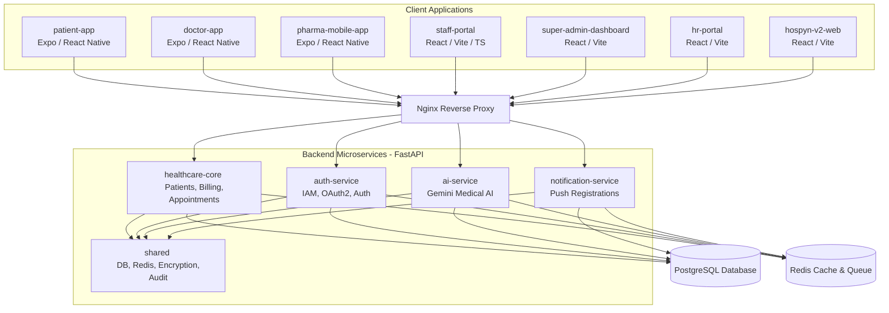

# Hospyn - Monorepo Platform Documentation

Welcome to the **Hospyn** platform codebase. This repository is structured as a unified monorepo containing all microservices, frontend applications (web and mobile), infrastructure, testing suites, and operations scripts.

---

## 🏢 Platform Architecture Overview

Hospyn uses a modern, distributed architecture to handle clinical workflows, patient portals, staff dashboards, and AI-driven medical assistance.



---

## 📂 Directory Structure & Technology Stack

The active monorepo workspaces are structured as follows:

| Directory | Tech Stack | Description |
| :--- | :--- | :--- |
| **`backend/healthcare-core`** | Python / FastAPI / SQLAlchemy / Alembic | Core clinical database API. Handles patient records, prescriptions, billing, queues, and appointments. |
| **`backend/auth-service`** | Python / FastAPI / Alembic | Handles global user authentication, JWT sessions, security configurations, and role-based access control (RBAC). |
| **`backend/ai-service`** | Python / FastAPI / Gemini API | Coordinates AI integrations, processing physician transcriptions and automated medical reports. |
| **`backend/notification-service`** | Python / FastAPI / Alembic | Handles push notification token registration and coordinates message dispatching. |
| **`backend/shared`** | Python | Core libraries shared across all backend microservices (database connection clients, Redis config, logging, and AES encryption). |
| **`backend/nginx`** | Nginx | Reverse proxy configuration for routing client calls to appropriate microservice ports. |
| **`backend/infra`** | Docker Compose / shell | Contains dev orchestration configurations and database initialization SQLs. |
| **`patient-app`** | React Native / Expo | Patient mobile application for booking appointments, checking in, and viewing medical history. |
| **`doctor-app`** | React Native / Expo | Clinician app for viewing queues, writing digital prescriptions, and conducting patient sessions. |
| **`pharma-mobile-app`** | React Native / Expo | Pharmacy mobile app for checking prescription codes and tracking local dispensary stock. |
| **`staff-portal`** | React / TypeScript / Vite | Desktop portal for hospital staff (receptionists, nurses, lab technicians) managing active check-ins and billing. |
| **`super-admin-dashboard`** | React / Vite | Global administration portal for operational governance, audit log viewers, and billing analysis. |
| **`hr-portal`** | React / Vite | HR dashboard managing staff directories and clinician schedules. |
| **`partner-app`** | React / Vite | Network partner management dashboard. |
| **`hospyn-v2-web`** | React / Vite / Tailwind CSS | Version 2 web interface. |
| **`packages/ui`** | React / CSS | Shareable UI component package used across web portals. |
| **`scripts`** | Python / Shell | Management utility scripts for chaos simulation, database backups, and manual data seeding. |
| **`tests`** | Python / Pytest | Robust testing suite including security audits, chaos testing, and adversarial red-teaming. |

---

## 🛠 Recent Refactoring & Cleanup Actions

The repository underwent a comprehensive restructuring to remove duplication, stabilize features, and enforce clean monorepo architecture:

1. **Backup Verification**:
   - Created a complete backup of the custom source files at `ahp-end-game-backup-2026-06-19` before removing legacy archives.
2. **Latest Downloads Merged**:
   - Integrated all verified latest fixes from the `Downloads` directory directly into their corresponding active workspaces (`backend`, `super-admin-dashboard`, `staff-portal`, `patient-app`, `doctor-app`).
   - Cleaned nested folders (e.g. aligned `doctor-app` up to the root level from `doctor-app-fixed-src` ZIP archive).
3. **Dead Folder Elimination**:
   - Excluded outdated duplicate paths (`app/`, `super-admin/`, `patient_fixes/`, `web/`, and legacy phase folders) containing flat, loose, or obsolete JavaScript files.
4. **Clean Workspace Isolation**:
   - Staged only the active **14 clean workspaces** under a fresh directory (`ahp-end-game-clean`) and successfully initialized Git, committed, and force-pushed to the remote GitHub repository (`main` branch).

---

## 🚀 Getting Started

### 1. Backend Services Setup
Ensure you have Python 3.10+ installed. Navigate to the service folder you want to run:

```bash
cd backend/healthcare-core
pip install -r requirements.txt
# Set environment variables in your .env
uvicorn app.main:app --reload --port 8000
```

To run local infrastructure (PostgreSQL, Redis):
```bash
cd backend/infra
docker-compose up -d
```

### 2. React Web Dashboards (Vite)
Web portals can be started using the standard Vite dev script:

```bash
cd staff-portal
npm install
npm run dev
```

### 3. Mobile Apps (Expo / React Native)
Ensure you have the Expo CLI set up:

```bash
cd patient-app
npm install
npx expo start
```
